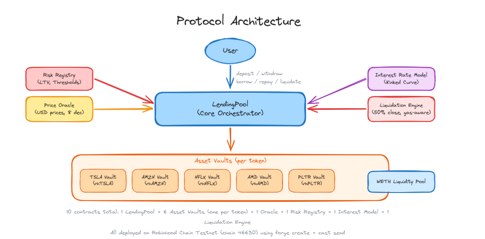
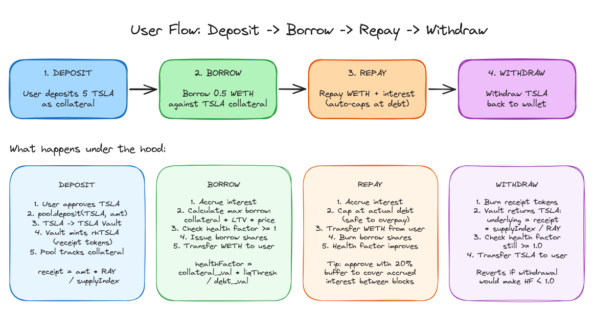

# RoboLend

A money market protocol for tokenized equities on Robinhood Chain. Users deposit tokenized stocks (TSLA, AMZN, PLTR, NFLX, AMD) as collateral and borrow WETH against them. The protocol enforces collateral ratios, liquidation thresholds, and market-hours awareness through an on-chain oracle.

Built for the Robinhood Chain Testnet (chain ID 46630).

## Architecture



10 contracts total: 1 LendingPool + 5 Asset Vaults (one per token) + 1 Oracle + 1 Risk Registry + 1 Interest Rate Model + 1 Liquidation Engine. The LendingPool is the core orchestrator -- all user actions (deposit, withdraw, borrow, repay, liquidate) go through it.

## User Flow



## Deployed Contracts

All contracts are deployed on Robinhood Chain Testnet.

| Contract | Address |
|----------|---------|
| LendingPool | [0x8E5F63D90B459f71a94FD86901A17a81a8F1e4AE](https://explorer.testnet.chain.robinhood.com/address/0x8E5F63D90B459f71a94FD86901A17a81a8F1e4AE) |
| Price Oracle | [0x6954b1F86A2c1615F8dc41969Cef57D558969e2c](https://explorer.testnet.chain.robinhood.com/address/0x6954b1F86A2c1615F8dc41969Cef57D558969e2c) |
| Liquidation Engine | [0x79129F69544ca67920eAc0a269817C1E79cfE7C1](https://explorer.testnet.chain.robinhood.com/address/0x79129F69544ca67920eAc0a269817C1E79cfE7C1) |
| WETH | [0x7943e237c7F95DA44E0301572D358911207852Fa](https://explorer.testnet.chain.robinhood.com/address/0x7943e237c7F95DA44E0301572D358911207852Fa) |
| TSLA | [0xC9f9c86933092BbbfFF3CCb4b105A4A94bf3Bd4E](https://explorer.testnet.chain.robinhood.com/address/0xC9f9c86933092BbbfFF3CCb4b105A4A94bf3Bd4E) |
| AMZN | [0x5884aD2f920c162CFBbACc88C9C51AA75eC09E02](https://explorer.testnet.chain.robinhood.com/address/0x5884aD2f920c162CFBbACc88C9C51AA75eC09E02) |
| PLTR | [0x1FBE1a0e43594b3455993B5dE5Fd0A7A266298d0](https://explorer.testnet.chain.robinhood.com/address/0x1FBE1a0e43594b3455993B5dE5Fd0A7A266298d0) |
| NFLX | [0x3b8262A63d25f0477c4DDE23F83cfe22Cb768C93](https://explorer.testnet.chain.robinhood.com/address/0x3b8262A63d25f0477c4DDE23F83cfe22Cb768C93) |
| AMD | [0x71178BAc73cBeb415514eB542a8995b82669778d](https://explorer.testnet.chain.robinhood.com/address/0x71178BAc73cBeb415514eB542a8995b82669778d) |

## Getting Started

```bash
# Frontend
cd apps
pnpm install
pnpm dev
```

```bash
# Contracts
forge build
forge test
```
